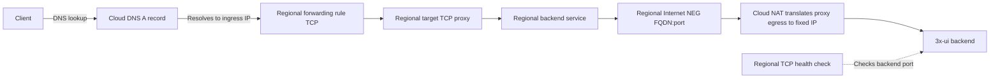

# CDN VPN Load Balancers

Ansible setup for regional Google Cloud TCP proxy load balancers with Internet NEG backends. A balancer accepts client TCP connections on its public IP and forwards them to a configured backend FQDN and port.

## Network flow



Cloud DNS resolves each configured hostname to the balancer's reserved ingress IP. The TCP proxy passes the connection through without terminating TLS. Google Cloud connects to the backend endpoint; Cloud NAT provides the configured static egress IP. The health check independently monitors the backend.

## Run Ansible

Run the playbook from the repository root on Linux. Also install the [Google Cloud CLI](https://cloud.google.com/sdk/docs/install-sdk).

```bash
sudo apt update
sudo apt install ansible-core
```

Install the Google Cloud CLI from Google's apt repository:

```bash
sudo apt install apt-transport-https ca-certificates gnupg curl
curl -fsSL https://packages.cloud.google.com/apt/doc/apt-key.gpg | sudo gpg --dearmor --yes -o /usr/share/keyrings/cloud.google.gpg
echo "deb [signed-by=/usr/share/keyrings/cloud.google.gpg] https://packages.cloud.google.com/apt cloud-sdk main" | sudo tee /etc/apt/sources.list.d/google-cloud-sdk.list >/dev/null
sudo apt update
sudo apt install google-cloud-cli
```

After installing the dependencies, authenticate with gcloud, select the project, and run the playbook:

```bash
gcloud auth login --no-launch-browser
# Open the displayed URL, complete authentication, and enter the verification code in the terminal.

export GCP_PROJECT_ID="vpn-cdn"
gcloud config set project "$GCP_PROJECT_ID"
ansible-playbook ansible/playbook.yml
```

Enable the Compute Engine and Cloud DNS APIs first. The authenticated Google account needs `roles/compute.networkAdmin`, `roles/compute.loadBalancerAdmin`, `roles/dns.admin`, and `roles/serviceusage.serviceUsageConsumer` in the project.

Ansible runs each `gcloud` operation as a task. It checks resources by name, skips existing resources without comparing or updating their fields, and creates missing ones. It does not delete resources removed from the inventory. No GitHub Actions, service-account key, or persistent state bucket is used.

For manual setup, see [`MANUAL_SETUP.md`](MANUAL_SETUP.md).

## Configure the inventory

The inventory file is [`config/inventory.yaml`](config/inventory.yaml). Replace the example values with your own. Add one `proxy_subnet_cidrs` entry per region and one `balancers` entry per balancer:

```yaml
dns_managed_zone: my-public-zone

proxy_subnet_cidrs:
  europe-west4: 10.0.0.0/24

router_asn: 64514
health_check_port: 445

balancers:
  edge1:
    region: europe-west4
    dns_name: edge1.example.net.
    backend_fqdn: backend1.example.org
    backend_port: 445
    frontend_port: 443
```

| Parameter | Description |
| --- | --- |
| `dns_managed_zone` | Name of the existing Cloud DNS managed zone in the project. |
| `proxy_subnet_cidrs` | Map of region to proxy-only subnet CIDR. Add an entry for every region; CIDRs must not overlap other VPC subnets. |
| Key in `balancers` | Unique base name for the balancer. The playbook derives the NEG, backend service, health check, target proxy, forwarding rule, and ingress IP names from it. |
| `balancers.<name>.region` | Google Cloud region for this balancer. Balancers in the same region share that region's proxy-only subnet, router, NAT, and egress IP. |
| `balancers.<name>.dns_name` | Unique fully qualified DNS hostname for this balancer's A record. Use a trailing dot and a hostname in the selected managed zone. |
| `balancers.<name>.backend_fqdn` | Public DNS name of the backend server registered in the Internet NEG. |
| `balancers.<name>.backend_port` | Port of the backend endpoint. |
| `balancers.<name>.frontend_port` | TCP port clients connect to; defaults to `443`. |

`GCP_PROJECT_ID` is read from the local environment. `router_asn` and `health_check_port` are set in the YAML inventory. Ansible requires Python on the control machine.

Add a balancer by adding another unique key under `balancers` and setting its named fields. Add a `proxy_subnet_cidrs` entry when using a new region. The backend connection limit is fixed at 1000 in the Ansible task and cannot be configured in the inventory.

The playbook does not reconcile field changes for existing resources. To change or remove existing infrastructure, update it manually with `gcloud`; changing the inventory alone will not update or delete it.
