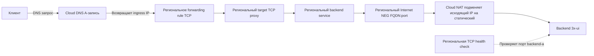

# CDN VPN: балансировщики нагрузки

Настройка через Ansible региональных TCP proxy балансировщиков Google Cloud с backend-ами типа Internet NEG. Балансировщик принимает TCP-соединения клиентов на публичный IP и перенаправляет их на заданные FQDN и порт backend-а.

## Схема сетевого взаимодействия



Cloud DNS преобразует hostname из inventory в зарезервированный ingress IP балансировщика. TCP proxy передаёт соединение дальше, не завершая TLS. Google Cloud подключается к endpoint backend-а; Cloud NAT обеспечивает заданный статический исходящий IP. Health check отдельно проверяет доступность backend-а.

## Запуск Ansible

Запускайте playbook из корня репозитория в Linux.

```bash
sudo apt update
sudo apt install ansible-core
```

Инструкции по установке Google Cloud CLI приведены в [официальной документации Google](https://cloud.google.com/sdk/docs/install).

После установки зависимостей задайте проект, войдите в Google Cloud CLI и запустите playbook:

```bash
# идем по предоставленной ссылке чтобы получить токен для аутентификации, авторизуем токеном gcloud консоль
gcloud auth login --no-launch-browser

# текущий проект "vpn-cdn"
export GCP_PROJECT_ID="vpn-cdn"
gcloud config set project "$GCP_PROJECT_ID"

# запускаем создание объектов балансировщиков
ansible-playbook ansible/playbook.yml
```

Предварительно включите Compute Engine API и Cloud DNS API. У аутентифицированного Google-аккаунта должны быть роли `roles/compute.networkAdmin`, `roles/compute.loadBalancerAdmin`, `roles/dns.admin` и `roles/serviceusage.serviceUsageConsumer` в проекте.

Ansible выполняет каждую операцию `gcloud` отдельной задачей. Он проверяет ресурсы по имени, пропускает существующие без сравнения или изменения их полей и создаёт отсутствующие. По умолчанию ресурсы, удалённые из inventory, не удаляются. GitHub Actions, ключ service account и постоянное хранилище состояния не используются.

Для поиска ресурсов, отсутствующих в inventory, запустите очистку в режиме просмотра:

```bash
ansible-playbook ansible/prune.yml
```

Playbook выведет найденные кандидаты, но не удалит их. После проверки списка подтвердите удаление отдельным запуском:

```bash
ansible-playbook ansible/prune.yml -e prune_confirmed=true
```

Очистка ищет ресурсы по соглашению об именах, используемому этим проектом. Общий `lb-network` не удаляется. DNS проверяется только по шаблону `<ключ-балансировщика>.<DNS-суффикс зоны>`; записи с произвольными hostname нужно удалять вручную. Перед подтверждением проверьте список, особенно если в проекте есть ресурсы с такими же именами.

Для ручной настройки используйте [инструкцию через `gcloud`](MANUAL_SETUP.ru.md).

## Настройка inventory

Файл inventory: [`config/inventory.yaml`](config/inventory.yaml). Замените демонстрационные значения на собственные. Добавьте запись в `proxy_subnet_cidrs` для каждого региона и запись в `balancers` для каждого балансировщика:

```yaml
dns_managed_zone: my-public-zone

proxy_subnet_cidrs:
  europe-west4: 10.0.0.0/24

router_asn: 64514
health_check_port: 445

balancers:
  edge1:
    region: europe-west4
    dns_name: edge1.example.net.
    backend_fqdn: backend1.example.org
    backend_port: 445
    frontend_port: 443
```

| Параметр | Назначение |
| --- | --- |
| `dns_managed_zone` | Имя существующей Cloud DNS managed zone в проекте. |
| `proxy_subnet_cidrs` | Map «регион → CIDR proxy-only subnet». Добавьте запись для каждого региона; CIDR не должен пересекаться с другими подсетями VPC. |
| Ключ в `balancers` | Уникальное базовое имя балансировщика. Скрипт формирует по нему имена NEG, backend service, health check, target proxy, forwarding rule и ingress IP. |
| `balancers.<name>.region` | Регион балансировщика. Балансировщики в одном регионе используют общие proxy-only subnet, router, NAT и egress IP этого региона. |
| `balancers.<name>.dns_name` | Уникальное полное DNS-имя A-записи балансировщика. Укажите hostname в выбранной зоне и завершающую точку. |
| `balancers.<name>.backend_fqdn` | Публичное DNS-имя backend-сервера, зарегистрированного в Internet NEG. |
| `balancers.<name>.backend_port` | Порт backend endpoint-а. |
| `balancers.<name>.frontend_port` | TCP-порт для клиентских подключений; по умолчанию `443`. |

`GCP_PROJECT_ID` передаётся playbook из локальной переменной окружения. `router_asn` и `health_check_port` задаются в YAML inventory. Для запуска Ansible на управляющей машине требуется Python.

Чтобы добавить балансировщик, добавьте новый уникальный ключ в `balancers` и заполните его именованные поля. Для нового региона добавьте запись в `proxy_subnet_cidrs`. Лимит соединений backend-а зафиксирован в Ansible-задаче на 1000 и не настраивается через inventory.

Скрипт не сверяет поля уже существующих ресурсов. Изменения и удаление существующей инфраструктуры выполняйте вручную через `gcloud`; одного изменения inventory недостаточно.
